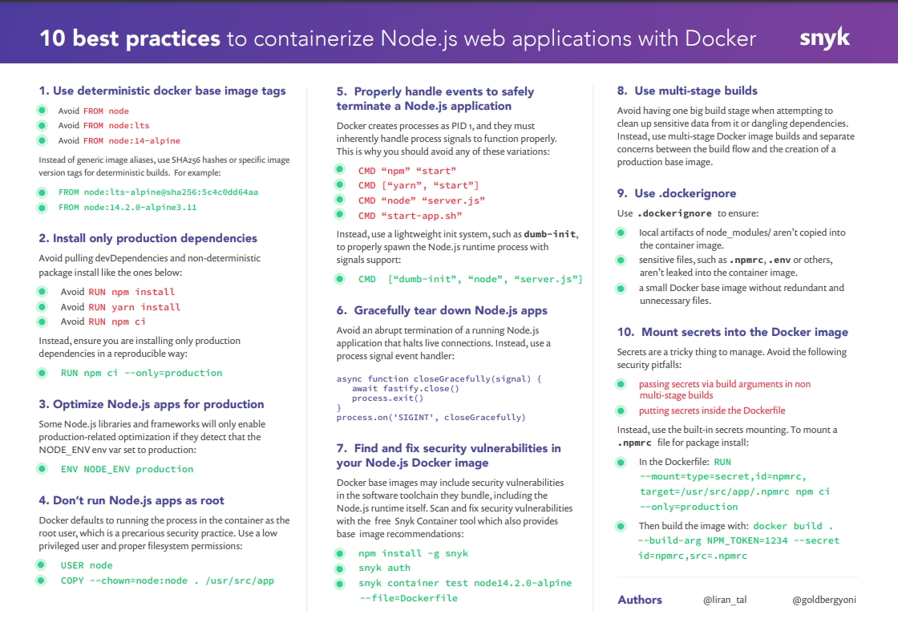

# Docker

## Useful commands

Build Image

```bash
docker build . -t $TAG

# no cache: --no-cache
# build args (like env vars): --build-arg NPM_TOKEN=$NPM_TOKEN
```

With file in monorepo:

```bash
docker build -t $TAG -f $FILE --build-arg NAME=value .
```

Check size

```bash
# save image
docker save $NAME -o $OUTPUT_FILE.tar
```

Run Image

```bash
# --net=host publishes host network to container, use it only for testing!
docker run --name $NAME -p 8080:8080 --net=host -d $TAG

# stop it with
docker stop $NAME
```

Monitoring

```bash
# images
docker images

# running container
docker ps

# logs
docker logs -f --tail 100 $NAME

# watch running instances
watch docker ps
```

Clean up (more [here](https://renehernandez.io/snippets/cleaning-local-docker-cache/))

```bash
# Removing unused containers
docker ps --filter status=exited --filter status=dead -q
docker rm $(docker ps --filter=status=exited --filter=status=dead -q)

# Removing dangling images
docker images --filter dangling=true -q
docker rmi $(docker images --filter dangling=true -q)
```

Navigate docker image

```bash
docker run -it $TAG sh
```

Stop all running containers

```bash
docker stop $(docker ps -a -q)
```

Remove all containers

```bash
docker rm $(docker ps -aq)
```

## Dockerfile Best Practices

Use the right Node base image: [https://snyk.io/blog/choosing-the-best-node-js-docker-image/](https://snyk.io/blog/choosing-the-best-node-js-docker-image/)



- [https://snyk.io/blog/10-best-practices-to-containerize-nodejs-web-applications-with-docker/](https://snyk.io/blog/10-best-practices-to-containerize-nodejs-web-applications-with-docker/)
- [https://github.com/nodejs/docker-node/blob/main/docs/BestPractices.md](https://github.com/nodejs/docker-node/blob/main/docs/BestPractices.md)

Using dumb-init

```dockerfile
# https://github.com/Yelp/dumb-init
RUN apk add dumb-init
```

Avoid calling `npm`, use instead:

```dockerfile
EXPOSE 8080
CMD ["dumb-init", "node", "dist/index.js"]
```

Non user example:

```dockerfile
FROM node:10-alpine

RUN mkdir -p /home/node/app/node_modules && chown -R node:node /home/node/app

WORKDIR /home/node/app

COPY package*.json ./

USER node

RUN npm install

COPY --chown=node:node . .

EXPOSE 8080

CMD [ "node", "app.js" ]
```
