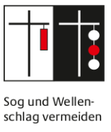
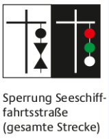
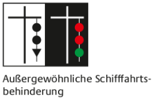

# SBF

## Praktische Prüfung

- [Kommandos](https://www.bootsschule-weiss.de/kommandos.html)
- [Kommandos PDF](https://fluxahoi.de/wp-content/uploads/2017/08/Kommandotafel_Motor.pdf)
- [Knoten](https://www.youtube.com/watch?v=JDyWECYKlDE&ab_channel=YACHTSCHULEMERIDIAN)

### Cheatsheet

#### Ablegen

- Lenkrad nach rechts
- **Eindampfen in die Vorspring**
- Fendern & Leinen klar
- achtern Horizontblick
- **Achtern frei! Vorspring los!**

#### Kursfahren nach Objekten / Kompass

- **Nehme Kurs auf in Richtung Objekt / 3-0-0 Grad**
- **Kurs liegt an.** oder **Kurs 3-0-0 liegt an.**

#### Kursgerechtes Aufstoppen

- achtern Horizontblick
- **Achtern frei!**
- Auskuppeln
- Rückwärstgang bis zum Stillstand
- Radeffekt nutzen, rechtsdrehender Propeller: Schiff dreht vorne nach Steuerbord --> Lenkrad nach rechts drehen
- **Manöver beendet** oder **Habe kursgerecht aufgestoppt**

#### Wende auf engstem Raum über Steuerbord/Backbord

- komplett nach Steuerbord/Backbord lenken, Blick nach Achtern, Rückwärtsgang
- **Achtern frei!**
- komplett zur anderen Seite einlenken
- (Wiederholen, bis Wende über 180 Grad)
- **Manöver beendet**

#### Mensch über Bord

- Maschine sofort auskuppeln, zum Menschen lenken
- **Mensch über Bord an Steuerbord/Backbord**
- **Rettungsmittel bereithalten**
- **Mensch im Blick behalten**
- Mit Wind und Strom vom Menschen wegfahren.
- **Nehme Fahrt gegen Wind und Strom auf.**
- **Bereitmachen zum Bergen an Steuerbord/Backbord**
- Neben Mensch aufstoppen, Maschine auskuppeln
- **Maschine neutral, Mensch an Bord nehmen!**

#### Anlegen

- **Klar zum Anlegen am an Steuerbord**
- **Leinen und Fender klarmachen an Steuerbord**
- In etwa 45 Grand anfahren
- Kurz vor erreichen etwas links einlenken
- Leerlauf
- Vollständig nach recht einlenken
- Rückwärtsgang
- **Leinen über, das Boot festmachen!**

#### Signale

- Achtung: 1 langer Ton
- nach Steuerbord: 1 kurzer Ton
- nach Backbord: 2 kurze Töne
- Rückwärtsfahrt: 3 kurze Töne

#### Sonstiges

- **Kompasskurs 240 Grad - wie lautet der Gegenkurs?** 180 Grad addieren oder abziehen.
- **Fahren Sie Kurs West! Wieviel Grad sind das?** 270 Grad
- **Der Motor fällt bei einer Fahrt auf dem Rhein aus. Was ist zu tun?** Fahrwasser verlassen, Anker werfen!
- **Wieviel Kette brauchen Sie beim Ankern?** Mindestens das 3 bis 5 fache der Wassertiefe.
- **Sicherheitsweste überprüfen!** TÜV Plakette, Patrone, Aufblasvorrichtuing, Ohnmachtssicher, Öse für Lifebelt
- **Lifebelt (Sicherheitsleine)** Y-förmig, 3 Karabiner
- **Was ist eine Kreuzpeilung? Was muss beachtet werden?**
  - 2 oder 3 bekannte in der Seekarte eingetragene Objekte peilen
  - Peilung mit Missweisung (und Deviation) beschicken
  - Keine schleifenden Schnitte (90 Grad +/- 30 Grad)
  - Bei 3 Peilungen ist der Standort in der Mitte des Fehlerdreiecks

### Knoten

1. **Achtknoten** verhindert das Durchraushen eines Endes.
2. **Webeleinstek** zum kurzzeitigen belegen (zB Fende, typischer Fenderknoten)
3. **Kreuzknoten** dient zum Verbinden zwei gleichstarker Enden. (hinten bleibt hinten, vorne bleibt vorne)
4. **Schotstek einfach** zum Verbinden zwei ungleich starker Enden (unterschiedliche Leinendicken)
5. **Schotstek doppelt** hält besser.
6. **Slipstek** zum kurzzeitigen belegen (Webelein auf Slip)
7. **Palstek** ist eine sich nicht zuziehende Schlinge (zB zum Festmachen an einen Pfahl oder Poller).
8. **Stopperstek** stoppt in eine Richtung und lässt sich in die andere verschieben (zB an einer Leine)
9. **1 1/2 Rundtörn und zwei halbe Schläge** zum dauerhaften Festmachen (zB an einem Ring oder an einer Stange).
10. **Belegen einer Klampe mit Kopfschlag** zum Festmachen des Fahrzeug am Steg.

### Feuer

| Abkürzung | Übersetzung       | Deutsch                                               | Dauer               |     |
| --------- | ----------------- | ----------------------------------------------------- | ------------------- | --- |
| F         | Fix               | Festfeuer                                             |                     |
| Oc (x)    | Occulting         | Unterbrochenes Feuer in Gruppen von x Unterbrechungen |                     |
| Iso       | Isophase          | Gleichtaktfeuer                                       |                     |
| LFl (x)   | Long Flash        | Blinkfeuer in x-er Gruppen                            | 2-4 Sekunden        |
| Fl (x)    | Flash             | Blitzfeuer in x-er Gruppen                            | 30x pro Minute      |
| Q (x)     | Quick             | Funkelfeuer                                           | 60x pro Minute      |
| IQ        | Interrupted Quick | Unterbrochenes Funkelfeuer                            |                     |
| VQ        | Very Quick        | Schnelles Funkelfeuer                                 | 100-120x pro Minute |

### Zeichen

### Navigationsaufgaben

#### Beschreibung von Tonnen

- 4 x

  - Farbe: rot-weiß senkrecht gestreift
  - Kennung: weißes Gleichtaktfeuer mit 8 Sekunden Wiederkehr
  - Toppzeichen: roter Ball

- 1 x

  - Farbe: gelb
  - Kennung: gelbes Blitzfeuer mit 4 Sekunden Wiederkehr
  - Toppzeichen: keines

- 1 x

  - Farbe: grün
  - Kennung: grünes unterbrochenes Feuer mit 4 Sekunden Wiederkehr
  - Toppzeichen: keines

- 1 x

  - Farbe: grün
  - Kennung: grünes unterbrochenes Feuer in 2er-Gruppen mit einer Wiederkehr von 9 Sekunden
  - Toppzeichen: keines

- 1 x

  - Farbe: oben schwarz und unten gelb
  - Kennung: weißes schnelles Funkelfeuer
  - Toppzeichen: zwei Kegel - beide "Spitze oben" - senkrecht übereinander

- 1 x

  - Farbe: gelb
  - Kennung: gelbes unterbrochenes Feuer mit 3 Gruppen und der Wiederkehr 12 Sekunden
  - Toppzeichen: keines

- 1 x

  - Farbe: rot
  - Kennung: rotes unterbrochenes Feuer in 3er-Gruppen und einer Wiederkehr von 12 Sekunden
  - Toppzeichen: keines

- 1 x

  - Farbe: rot
  - Kennung: rotes unterbrochenes Funkelfeuer mit 13 Sekunden Wiederkehr
  - Toppzeichen: roter Zylinder

- 1 x

  - Farbe: grün
  - Kennung: grünes Funkelfeuer
  - Toppzeichen: grüner Kegel Spitze oben

#### Sonstiges

- Position der Gezeitenstromangabe, oder "Stromraute"
- Wracks mit 3,7m bzw. 1,4m Tiefe
- Kartentiefe 24m
- Nord-Kardinal-Zeichen. Zeigt an, dass die Gefahrenstelle nördlich der Tonne sicher umfahren werden kann
- Ost-Kardinal-Zeichen. Zeigt an, dass die Gefahrenstelle östlich der Tonne sicher umfahren werden kann
- Festfeuer in Sektoren in den Farben weiß, rot und grün. Feuerhöhe 33m, Tragweiten 23sm bis 18sm
- Nebelhorn in den Morsebuchstaben A und L alle 60 Sekunden
- Kennzeichnung der Zufahrt von Fahrwassern und der Mitte von Schifffahrtswegen
- Blink in 3er Gruppen, weiß-rot-grün. 20 Sekunden Wiederkehr. Feuerträger 38m hoch. Nenntragweite 16sm bis 11sm
- Kartenfarben:
  - weiß: tiefes Wasser
  - hellblau: flaches Wasser
  - hellgrün: Watt
  - hellgelb: Land
- Schifffahrtshindernis mit einer Kartentiefe von 9,7m

## Theorie Binnen

- [Theorietexte](https://www.bootspruefung.de/theorie/sbf-binnen)
